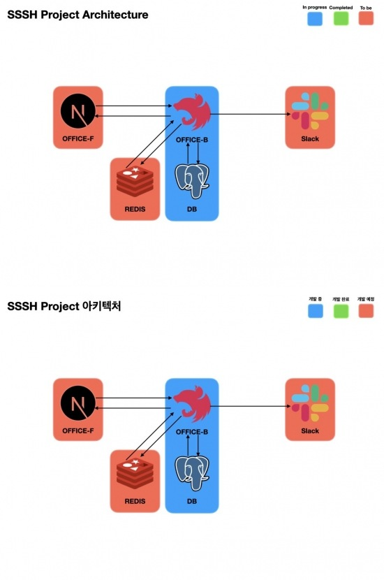

# SSSH BACK-OFFICE

## 기능
1. 유저 관리 기능
  - **JWT**를 사용한 ACCESS/REFESH TOKEN 구조
    - ACCESS TOKEN을 사용하여 권한 조정
    - REFESH TOKEN은 **REDIS**를 사용하여 등록되어있는 토큰인지 확인_(개발중)_
  - 권한에 따라 API 접근 기능(기본적으로 전부 PRIVATE API)
2. 인스타그램 관리 기능_(개발중)_
  - 인스타그램 계정 관련 노티(슬랙과 연동 예정)
  - 개발 내용 크롤링 및 요약 후 제공
  - 해당 내용을 토대로 이미지 생성(RUST?)

## 아키텍처

## 구동방법
- 개발환경 세팅
  1. VSCODE DevContainer 사용하여 컨테이너에서 개발
  2. 다른 IDE를 사용하는 경우 로컬 PC에 아래 환경 설치
    - node v18.19.0, npm 사용
    - TS 관련 세팅은 package.json 참조
    - npm install -g @nestjs/cli
    - postgres 15.6 DB 세
- 구동
  1. 로컬 구동
    - 환경 변수 파일(왼쪽부터 존재하는 파일인 경우 적용) : .env.local, .env.development, .env팅
      - 환경 변수 파일 내 DB 정보 세팅
    - `npm run start:dev` 를 통해 --watch로 구동
  2. 서버에서 구동(linux)
    - 루트 경로의 docker-compose.yml와 Dockerfile을 사용하여 구동

## 주의점
- SSSH 프로젝트에서 전역적으로 사용할 타입인 경우 @types/sssh 프로젝트에 추가하여 사용